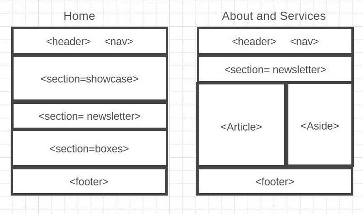

# Development Strategy

> `Acme-web-design`

- This is responsive mobile friendly HTML5 website for a fictional web design company.
- A web-site is a very best way to advertise the companies product and services.

## Wireframe

<!-- include a wireframe for your project in this repository, and display it here -->

<!-- wireframe.cc is a good site for getting started with wireframes -->

## Set-Up

**A User can see my initial [repository](https://github.com/gelilaa/acme-web-design) and [live]( https://gelilaa.github.io/acme-web-design/.) demo**

### Repo

- Generate from Template
- Write initial, basic README
- Turn on GitHub Pages

##  About

The project is build for the purpose of learning Incremental development with html and css files.

# Branches

### 1-header

In this branch I add a title, header and navigation for the page and style it.

### HTML

- Header html mark-up

### CSS

- Header CSS styling body, container, header and  global **ul** styling 

## 2-showcase 

In this branch I add the main part of the website add a background image and style it

### HTML
- Add html mark-up sections
> Add background image
### CSS
Showcase css 

For some reason my background image was not accepted on the css file. So I put inline styling with the element.

 

## 3-newsletter

Here the padding for the background has been changed.
### HTML

Add html mark up
### CSS
Add css styling, add global button styling

## 4-boxes

Here I add pictures and boxes
>3 images

### HTML

Html mark-up

### CSS 
css styling for the boxes 

## 5-footers 
Here I add the footer and the stylings
### HTML

footer mark-up
### CSS

css styling for the footer

## 6-about us
Here I add the about.html
### HTML

html mark-up for about.html 

### CSS

css stylings and global class “dark”

## 7-services
Here I add the page services.html

### HTML

html mark-up for services.html

### CSS
css stylings and css @media rule.

## 8-touch ups 
In this branch I add some extra css stylings to make the website responsive.

